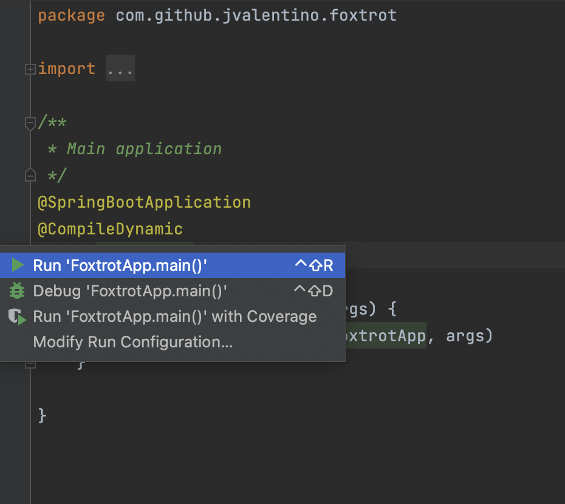
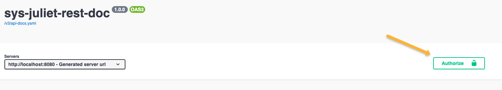

# System Juliet UI BFF

This application serves as the BFF for the UI as part of the overall https://github.com/jvalentino/sys-juliet project as they relate to documents. For system level details, please see that location.

Prerequisites

- Java
- IntelliJ
- Docker
- Docker Compose
- Git
- Minikube
- Helm
- Redis
- Redis Desktop

All of these you can get in one command using this installation automation (if you are on a Mac): https://github.com/jvalentino/setup-automation

# Contents

- [Summary](#summary)
  * [Redis & Wiremock](#redis--wiremock)
  * [IDE Testing](#ide-testing)
  * [Runtime](#runtime)
  * [Verification](#verification)
  * [Strategy](#strategy)
  * [Build](#build)
  * [Deploy](#deploy)
  * [Build & Deploy](#build--deploy)
- [Dev](#dev)
  * [Runtime Validation](#runtime-validation)
    + [Runtime Validation (Live)](#runtime-validation-live)
      - [**IDE**](#ide)
      - [Swagger UI](#swagger-ui)
      - [/](#)
      - [/custom-login](#custom-login)
      - [/dashboard (Auth Required)](#dashboard-auth-required)
      - [/view-versions/{docId} (Auth Required)](#view-versionsdocid-auth-required)
      - [/version/download/{docVersionId} (Auth Required)](#versiondownloaddocversionid-auth-required)
      - [/upload-file (Auth Required)](#upload-file-auth-required)
      - [/version/new/{docId} (Auth Required)](#versionnewdocid-auth-required)
    + [Runtime Validation (Mocked)](#runtime-validation-mocked)
      - [IDE](#ide)
      - [**Command-Line**](#command-line)
  * [Prometheus](#prometheus)
    + [build.gradle](#buildgradle)
    + [application.properties](#applicationproperties)
    + [SpringWebConfig](#springwebconfig)
    + [WebSecurityConfig](#websecurityconfig)
  * [Docker](#docker)
    + [build-docker.sh](#build-dockersh)
    + [Dockerfile](#dockerfile)
    + [fluentbit.conf](#fluentbitconf)
    + [start.sh](#startsh)
  * [OpenAPI](#openapi)
    + [build.gradle](#buildgradle-1)
    + [SpringWebConfig](#springwebconfig-1)
    + [application.properties](#applicationproperties-1)
    + [UI](#ui)
    + [WebSecurityConfig](#websecurityconfig-1)
  * [Resilience4j](#resilience4j)
    + [build.gradle](#buildgradle-2)
    + [Controllers](#controllers)
    + [application.yml](#applicationyml)
    + [/actuator/health](#actuatorhealth)
  * [API Key Security](#api-key-security)
    + [SwaggerConfiguration](#swaggerconfiguration)
  * [Spring Security](#spring-security)
    + [WebSecurityConfig](#websecurityconfig-2)
    + [application.yml](#applicationyml-1)
    + [build.gradle](#buildgradle-3)
    + [BffRest](#bffrest)
    + [AuthService](#authservice)
    + [MyCORSFilter](#mycorsfilter)
  * [Swagger Code Generation](#swagger-code-generation)
    + [config/swagger/doc-api-docs.yaml](#configswaggerdoc-api-docsyaml)
    + [Config/swagger/doc-config.json](#configswaggerdoc-configjson)
    + [config/swagger/user-api-docs.yaml](#configswaggeruser-api-docsyaml)
    + [config/swagger/user-config.json](#configswaggeruser-configjson)
    + [build.gradle](#buildgradle-4)
    + [config/gradle/swagger.gradle](#configgradleswaggergradle)

# Summary

## Redis & Wiremock

You launch the Redis and Wiremock container by running:

```
docker compose up -d
```

This sill executes the container in detached mode, and leave it running in the background.

You can verify that Redis is running using the Redis desktop manager using port 6379 and password "redis":


You can verify that wiremock is running by hitting http://localhost:8888/api/test

```json
{
 	"test":"data"
}
```


## IDE Testing

This imports as a standard Gradle project, in which you are able to easily execute tests:

[](https://github.com/jvalentino/sys-alpha-bravo/blob/main/wiki/testing.png)

## Runtime

You can run the main class as a Spring Boot application:



## Verification

[](https://github.com/jvalentino/sys-alpha-bravo/blob/main/wiki/ide_check.png)

Running check will execute both testing and static code analysis via the build.

This is otherwise the same as doing this at the command-line: `./gradlew check`

## Strategy

Codenarc is used to ensure that no common coding issues can be added.

Jacoco is used to enforce that line coverage is over 85%.

Tests that end in "IntgTest" are used for integration testing via Spring Boot Test, otherwise they are unit tests.

Every code commit triggers a Github Action pipeline that runs the entire build process.

## Build

The following builds the executable jar file:

```bash
./gradlew build
```

...and then the following builds and publishing locally the docker image:

```bash
./build-docker.sh
```


## Deploy

The following deploys the docker image to Kubernetes via Helm:

```bash
./deploy.sh
```

If it worked you can access it via http://localhost:8082/swagger-ui/index.html

## Build & Deploy

If you just want to rebuild and deploy everything, run:

```bash
./build-and-deploy.sh
```


# Dev

## Runtime Validation

Consider that there are two ways to run this application:

- Live - Requires that the rest-doc application be running at http://localhost:8080, and the rest-user application be running at http://localhost:8081
- Wiremock - Replaces the usage of http://localhost:8080 and http://localhost:8081 wire the wiremock instance at http://localhost:8888

### Runtime Validation (Live)

It is then recommended you run thus application on port 8082, which can be done in two ways:

#### **IDE**


**Command-Line**

```bash
java -jar --server.port=8082 build/libs/sys-juliet-ui-bff-0.0.1.jar
```

#### Swagger UI

The Swagger UI can then be accessed via http://localhost:8082/swagger-ui/index.html


This RESTful services represent exactly the original endpoints from the previous single backend called https://github.com/jvalentino/sys-golf-rest

Consider that / and /custom-login are the only unprotected endpoints, and the rest of the endpoints require you to be logged in. The following will explain how to login and then set the appropriate authorization headers.

#### /

The purpose of this service is to return the root payload, which is just a count of users and documents:


#### /custom-login

This is the way in which you login, which results in a session ID:


The input payload will always be this:

```json
{
  "email": "admin",
  "password": "37e098f0-b78d-4a48-adf1-e6c2568d4ea1"
}
```

...and the result will contain the Session ID, which becomes the `X-Auth-Token`:

```json
{
  "success": true,
  "message": null,
  "sessionId": "61df0dc2-ce6f-42e9-9db3-6aa9112524bc",
  "sessionIdBase64": "NjFkZjBkYzItY2U2Zi00MmU5LTlkYjMtNmFhOTExMjUyNGJj"
}
```

In this case the Session ID is `61df0dc2-ce6f-42e9-9db3-6aa9112524bc`, which you then put into the `Authorize` button:




#### /dashboard (Auth Required)


#### /view-versions/{docId} (Auth Required)


#### /version/download/{docVersionId} (Auth Required)


#### /upload-file (Auth Required)


This won't work, because the input is actually a multi-part encoded file, and Swagger is not picking that up. The only way to validate this is to use the UI for the moment.

#### /version/new/{docId} (Auth Required)


This won't work, because the input is actually a multi-part encoded file, and Swagger is not picking that up. The only way to validate this is to use the UI for the moment.

### Runtime Validation (Mocked)

This variant of the runtime environment replaces the two RESTful backing applications with our wiremock instance, where every endpoint has been replaced with defaulted responses. 

#### IDE

It is then recommended you run thus application on port 8082, which can be done in two ways:


#### **Command-Line**

```bash
java -jar \
	--server.port=8082 \
	--management.apiDocUrl=http://localhost:8888 \
  --management.apiUserUrl=http://localhost:8888 \
	build/libs/sys-juliet-ui-bff-0.0.1.jar
```


## Prometheus

Getting Prometheus to work required the following steps:

### build.gradle

```groovy
// monitoring
	implementation 'org.springframework.boot:spring-boot-starter-actuator'
	implementation 'io.micrometer:micrometer-registry-prometheus'
```

### application.properties

```properties
management.endpoints.web.exposure.include=health, metrics, prometheus
```

### SpringWebConfig

```groovy
@Override
    void configureMessageConverters(List<HttpMessageConverter<?>> converters) {
        converters.add(new MappingJackson2HttpMessageConverter(jsonMapper()))

        // requires for prometheus endpoint
        StringHttpMessageConverter converter = new StringHttpMessageConverter()
        converter.setSupportedMediaTypes(Arrays.asList(
                MediaType.TEXT_PLAIN,
                new MediaType('application', 'openmetrics-text')))
        converters.add(converter)

        // No converter for [class java.lang.String] with preset Content-Type
        // 'application/openmetrics-text;version=1.0.0;charset=utf-8']
    }
```

### WebSecurityConfig

```groovy
@Configuration
@EnableWebSecurity
@Slf4j
@CompileDynamic
class WebSecurityConfig extends WebSecurityConfigurerAdapter {

   //...

    @Override
    protected void configure(HttpSecurity http) throws Exception {
        // https://stackoverflow.com/questions/32064000/uploading-file-returns-403-error-spring-mvc
        http.cors().and().csrf().disable()

        http
                .authorizeRequests()
                .antMatchers(
                        '/resources/**',
                        '/webjars/**',
                        '/',
                        '/custom-login',
                        '/invalid',
                        '/actuator/prometheus',
                        '/actuator/health',
                        '/v3/**',
                        '/swagger-ui/**',
                ).permitAll()
                .anyRequest().authenticated()
    }

}
```


## Docker

### build-docker.sh

You build the docker image by running this:

```bash
./build-docker.sh
```

This script consists of the following:

```bash
#!/bin/bash

NAME=sys-juliet-ui-bff
VERSION=latest
HELM_NAME=sys-ui-bff

helm delete $HELM_NAME || true
minikube image rm $NAME:$VERSION
rm -rf ~/.minikube/cache/images/arm64/$NAME_$VERSION || true
docker build --no-cache . -t $NAME
minikube image load $NAME:$VERSION
```

There is quite a bit of magic in here not directly relating to docker. This scripting ensures we build a clean new image, make sure to remove it if it is running in Minikube, and then load it back into the cache.

### Dockerfile

The container for running this application consists of two parts:

- Openjdk - For running the application
- Fluentbit - A log forwarder to take the log files from nginx and forward them to Elasticsearch.

```docker
FROM openjdk:11
WORKDIR .
COPY build/libs/sys-juliet-ui-bff-0.0.1.jar /usr/local/sys-juliet-ui-bff-0.0.1.jar
EXPOSE 8080
COPY config/docker/start.sh /usr/local/start.sh

# puts it in /opt/fluent-bit/bin/fluentbit
RUN curl https://raw.githubusercontent.com/fluent/fluent-bit/master/install.sh | sh
COPY config/docker/fluentbit.conf /opt/fluent-bit/bin/fluentbit.conf

RUN ["chmod", "+x", "/usr/local/start.sh"]
ENTRYPOINT ["/usr/local/start.sh"]
```

### fluentbit.conf

```properties
[INPUT]
    name              tail
    path              /usr/local/*.log
    multiline.parser docker, cri

[OUTPUT]
    Name  es
    Match *
    Host elasticsearch-master
    Port 9200
    Index sys-ui-bff
    Suppress_Type_Name On
```

This configuration picks up the custom log files, and forward them to elastic search using the index of `backend`.

### start.sh

We already have a custom script for our entry point, where we now change it to also run fluent bit in the background:

```bash
#!/bin/bash
cd /opt/fluent-bit/bin
./fluent-bit -c fluentbit.conf > fluentbit.log 2>&1 &

cd /usr/local
java -jar \
  -Dspring.redis.host=redis-master \
  -Dmanagement.apiDocUrl=http://sys-rest-doc:8080 \
  -Dmanagement.apiUserUrl=http://sys-rest-user:8080 \
  sys-juliet-ui-bff-0.0.1.jar

```

## OpenAPI

> The OpenAPI Specification, previously known as the Swagger Specification, is a specification for a machine-readable interface definition language for describing, producing, consuming and visualizing RESTful web services

- https://en.wikipedia.org/wiki/OpenAPI_Specification

The only reason this was more than once step, is because I had overridden the default JSON converter to handle hibernate entities, which messed it up for Swagger. The result was a series of workarounds.

### build.gradle

```groovy
implementation 'org.springdoc:springdoc-openapi-ui:1.6.15'
implementation 'org.springdoc:springdoc-openapi-webmvc-core:1.6.15'
implementation 'org.springdoc:springdoc-openapi-groovy:1.6.15'
```

### SpringWebConfig

```groovy
@EnableWebMvc
@Configuration
@Slf4j
@CompileDynamic
@SuppressWarnings(['UnnecessarySetter'])
class SpringWebConfig implements WebMvcConfigurer {

    ObjectMapper jsonMapper() {
        new CustomObjectMapper()
    }

    @Override
    void configureMessageConverters(List<HttpMessageConverter<?>> converters) {
        converters.add(new StringHttpMessageConverter())
        converters.add(new MappingJackson2HttpMessageConverter(jsonMapper()))

        // requires for prometheus endpoint
        StringHttpMessageConverter converter = new StringHttpMessageConverter()
        converter.setSupportedMediaTypes(Arrays.asList(
                MediaType.TEXT_PLAIN,
                new MediaType('application', 'openmetrics-text')))
        converters.add(converter)

        converters.add(new ByteArrayHttpMessageConverter())

        // No converter for [class java.lang.String] with preset Content-Type
        // 'application/openmetrics-text;version=1.0.0;charset=utf-8']
    }

}

```

Had to add 

- `converters.add(new StringHttpMessageConverter())`
- `converters.add(new ByteArrayHttpMessageConverter())`

...which allows http://localhost:8080//v3/api-docs.yaml to render, which is important in the next step

### application.properties

```properties
springdoc.swagger-ui.url=/v3/api-docs.yaml
```

This is done to have Swagger use the YAML endpoint instead of the JSON one, because we busted the JSON endpoint with our Jackson magic.

### UI

The result of all this magic is that you can now get to http://localhost:8080/swagger-ui/index.html, and see:


### WebSecurityConfig

```groovy
@Configuration
@EnableWebSecurity
@Slf4j
@CompileDynamic
class WebSecurityConfig extends WebSecurityConfigurerAdapter {

    // ...
  
    @Override
    protected void configure(HttpSecurity http) throws Exception {
        // https://stackoverflow.com/questions/32064000/uploading-file-returns-403-error-spring-mvc
        http.cors().and().csrf().disable()

        http
                .authorizeRequests()
                .antMatchers(
                        '/resources/**',
                        '/webjars/**',
                        '/',
                        '/custom-login',
                        '/invalid',
                        '/actuator/prometheus',
                        '/actuator/health',
                        '/v3/**',
                        '/swagger-ui/**',
                ).permitAll()
                .anyRequest().authenticated()
    }

}
```


## Resilience4j

> Resilience4j is a lightweight fault tolerance library designed for functional programming. Resilience4j provides higher-order functions (decorators) to enhance any functional interface, lambda expression or method reference with a Circuit Breaker, Rate Limiter, Retry or Bulkhead. You can stack more than one decorator on any functional interface, lambda expression or method reference. The advantage is that you have the choice to select the decorators you need and nothing else.

- https://resilience4j.readme.io/docs

### build.gradle

```groovy
// Circuit Breaker (Hystrix Replacement)
	implementation group: 'io.github.resilience4j', name: 'resilience4j-spring-boot2', version: '1.7.0'
```

### Controllers

```groovy
@GetMapping('/doc/all')
    @CircuitBreaker(name = 'DocAll')
    DocListDto dashboard() {
        DocListDto dashboard = new DocListDto()
        dashboard.with {
            documents = docService.allDocs()
        }

        dashboard
    }
    
    //....
```

You want to annotate every endpoint with a name.

### application.yml

```yaml
management:
  health:
    circuitbreakers:
      enabled: 'true'
    ratelimiters:
      enabled: 'true'
  endpoints:
    web:
      exposure:
        include: '*'
  endpoint:
    health:
      show-details: always
--- More stuff...
resilience4j:
  circuitbreaker:
    instances:
      DocAll:
        registerHealthIndicator: true
        ringBufferSizeInClosedState: 5
        ringBufferSizeInHalfOpenState: 3
        waitDurationInOpenState: 10s
        failureRateThreshold: 50
        maxRetryAttempts: 3
        waitDuration: 5000
      DocUpload:
        registerHealthIndicator: true
        ringBufferSizeInClosedState: 5
        ringBufferSizeInHalfOpenState: 3
        waitDurationInOpenState: 10s
        failureRateThreshold: 50
        maxRetryAttempts: 3
        waitDuration: 5000
      DocVersions:
        registerHealthIndicator: true
        ringBufferSizeInClosedState: 5
        ringBufferSizeInHalfOpenState: 3
        waitDurationInOpenState: 10s
        failureRateThreshold: 50
        maxRetryAttempts: 3
        waitDuration: 5000
      DocDownload:
        registerHealthIndicator: true
        ringBufferSizeInClosedState: 5
        ringBufferSizeInHalfOpenState: 3
        waitDurationInOpenState: 10s
        failureRateThreshold: 50
        maxRetryAttempts: 3
        waitDuration: 5000
      DocVersionNew:
        registerHealthIndicator: true
        ringBufferSizeInClosedState: 5
        ringBufferSizeInHalfOpenState: 3
        waitDurationInOpenState: 10s
        failureRateThreshold: 50
        maxRetryAttempts: 3
        waitDuration: 5000
```

You then declare the settings for each endpoint.

### /actuator/health

```json
{
   "status":"UP",
   "components":{
      "circuitBreakers":{
         "status":"UP",
         "details":{
            "DocVersionNew":{
               "status":"UP",
               "details":{
                  "failureRate":"-1.0%",
                  "failureRateThreshold":"50.0%",
                  "slowCallRate":"-1.0%",
                  "slowCallRateThreshold":"100.0%",
                  "bufferedCalls":0,
                  "slowCalls":0,
                  "slowFailedCalls":0,
                  "failedCalls":0,
                  "notPermittedCalls":0,
                  "state":"CLOSED"
               }
            },
            "DocDownload":{
               "status":"UP",
               "details":{
                  "failureRate":"-1.0%",
                  "failureRateThreshold":"50.0%",
                  "slowCallRate":"-1.0%",
                  "slowCallRateThreshold":"100.0%",
                  "bufferedCalls":0,
                  "slowCalls":0,
                  "slowFailedCalls":0,
                  "failedCalls":0,
                  "notPermittedCalls":0,
                  "state":"CLOSED"
               }
            },
            "DocVersions":{
               "status":"UP",
               "details":{
                  "failureRate":"-1.0%",
                  "failureRateThreshold":"50.0%",
                  "slowCallRate":"-1.0%",
                  "slowCallRateThreshold":"100.0%",
                  "bufferedCalls":0,
                  "slowCalls":0,
                  "slowFailedCalls":0,
                  "failedCalls":0,
                  "notPermittedCalls":0,
                  "state":"CLOSED"
               }
            },
            "DocUpload":{
               "status":"UP",
               "details":{
                  "failureRate":"-1.0%",
                  "failureRateThreshold":"50.0%",
                  "slowCallRate":"-1.0%",
                  "slowCallRateThreshold":"100.0%",
                  "bufferedCalls":0,
                  "slowCalls":0,
                  "slowFailedCalls":0,
                  "failedCalls":0,
                  "notPermittedCalls":0,
                  "state":"CLOSED"
               }
            },
            "DocAll":{
               "status":"UP",
               "details":{
                  "failureRate":"-1.0%",
                  "failureRateThreshold":"50.0%",
                  "slowCallRate":"-1.0%",
                  "slowCallRateThreshold":"100.0%",
                  "bufferedCalls":0,
                  "slowCalls":0,
                  "slowFailedCalls":0,
                  "failedCalls":0,
                  "notPermittedCalls":0,
                  "state":"CLOSED"
               }
            }
         }
      },
      "db":{
         "status":"UP",
         "details":{
            "database":"PostgreSQL",
            "validationQuery":"isValid()"
         }
      },
      "diskSpace":{
         "status":"UP",
         "details":{
            "total":494384795648,
            "free":356838473728,
            "threshold":10485760,
            "exists":true
         }
      },
      "ping":{
         "status":"UP"
      },
      "rateLimiters":{
         "status":"UNKNOWN"
      }
   }
}
```

## API Key Security

Since this is an API intended to be called only by an authorized party, we need at least some basic security. In this case, I am using the concept of an API Key. Specifically, every request will be expected to require the HTTP Header of `X-Auth-Token` with the appropriate value, at least when calling the explicitly secure services under `/doc`.

### SwaggerConfiguration

```groovy
@Configuration
@CompileDynamic
@SuppressWarnings(['DuplicateStringLiteral'])
class SwaggerConfiguration {

    @Value('${spring.application.name}')
    String appName

    // https://stackoverflow.com/questions/63671676/
    // springdoc-openapi-ui-add-jwt-header-parameter-to-generated-swagger
    @Bean
    OpenAPI customOpenAPI() {
        new OpenAPI()
                .info(new Info().title(appName).version('1.0.0'))
                .components(new Components()
                        .addSecuritySchemes('X-Auth-Token', new SecurityScheme()
                                .type(SecurityScheme.Type.APIKEY)
                                .in(SecurityScheme.In.HEADER)
                                .name('X-Auth-Token')))
                .addSecurityItem(new SecurityRequirement().addList('X-Auth-Token'))
    }

}
```

First we have to tell Swagger to put an "Authorize" button in its user interface, that we can use to provide this X-Auth-Token with every request.


## Spring Security

Spring Security is being used in conjunction with Redis based session management.

### WebSecurityConfig

```groovy
@Configuration
@EnableWebSecurity
@Slf4j
@CompileDynamic
class WebSecurityConfig extends WebSecurityConfigurerAdapter {

    @Autowired
    AuthService authService

    // https://stackoverflow.com/questions/4664893/
    // //how-to-manually-set-an-authenticated-user-in-spring-security-springmvc
    @Bean
    AuthenticationManager customAuthenticationManager() throws Exception {
        new AuthenticationManager() {

            @Override
            Authentication authenticate(Authentication authentication) throws AuthenticationException {
                authService.authenticate(authentication)
            }

        }
    }

    @Bean
    HttpSessionIdResolver httpSessionIdResolver() {
        HeaderHttpSessionIdResolver.xAuthToken()
    }

    @Override
    protected void configure(HttpSecurity http) throws Exception {
        // https://stackoverflow.com/questions/32064000/uploading-file-returns-403-error-spring-mvc
        http.cors().and().csrf().disable()

        http
                .authorizeRequests()
                .antMatchers(
                        '/resources/**',
                        '/webjars/**',
                        '/',
                        '/custom-login',
                        '/invalid',
                        '/actuator/prometheus',
                        '/actuator/health',
                        '/v3/**',
                        '/swagger-ui/**',
                ).permitAll()
                .anyRequest().authenticated()
    }

}
```

This is where you both have to define the endpoints that are not secured, in combination with defining how you want to do authorization. 

### application.yml

```yaml
spring:
  redis:
    host: localhost
    port: 6379
    password: redis
  session:
    store-type: redis
```

This is saying to use Redis for session management.

### build.gradle

```groovy
// Security (Login)
	implementation 'org.springframework.boot:spring-boot-starter-security'
	implementation group: 'org.springframework.session', name: 'spring-session-core', version: '2.7.0'

	// Redis
	implementation 'org.springframework.session:spring-session-data-redis'
	implementation 'org.springframework.boot:spring-boot-starter-data-redis'
```

### BffRest

```groovy
@CompileDynamic
@Slf4j
@RestController
@SuppressWarnings(['UnnecessarySetter', 'UnnecessaryGetter'])
class BffRest {

  @PostMapping('/custom-login')
    @CircuitBreaker(name = 'CustomLogin')
    LoginDto login(@RequestBody UserDto user, HttpSession session) {
        LoginDto result = authService.login(user, authenticationManager, session)
        result
    }
```

We define the login endpoint, which delegates to your serivce.

### AuthService

```groovy
@Slf4j
@CompileDynamic
@Service
@SuppressWarnings(['UnnecessaryGetter', 'UnnecessarySetter'])
class AuthService {

    AuthService instance = this

    @Autowired
    UserRestApi userRestApi

    ResultDto login(UserDto user, AuthenticationManager authenticationManager, HttpSession session) {
        log.info('Attempting to login the user user by email of ' + user.email)

        try {
            Authentication authentication = authenticationManager.authenticate(
                    new UsernamePasswordAuthenticationToken(user.email, user.password))
            SecurityContextHolder.getContext().setAuthentication(authentication)
            String sessionId = session.getId()
            log.info("${user.email} is logged in with session ID ${sessionId}")
            return new LoginDto(sessionId:sessionId, sessionIdBase64:sessionId.bytes.encodeBase64())
        } catch (e) {
            log.error("${user.email} gave invalid credentials", e)
        }

        new LoginDto(success:false, message:'Invalid Credentials')
    }

    @SuppressWarnings(['ThrowException'])
    Authentication authenticate(Authentication authentication) {
        UsernamePasswordAuthenticationToken auth = authentication

        String authUserId = instance.retrieveCurrentlyLoggedInUserId()
        log.info("Authenticating ${authUserId}...")

        // if they have not logged in, do so
        if (authUserId == 'anonymousUser' || authUserId == null) {
            log.info('Not logged in to we have to first login...')
            AuthUser user = instance.isValidUser(auth.getPrincipal(), auth.getCredentials())
            if (user != null) {
                return new UsernamePasswordAuthenticationToken(user.authUserId, auth.getCredentials())
            }

            throw new Exception('Invalid username and/or password')
        }

        // they are already logged in
        log.info("${authUserId} is already logged in")
        authentication
    }

    AuthUser isValidUser(String email, String password) {
        try {
            AuthUser user = userRestApi.login(new UserDto(email:email, password:password))
            return user
        } catch (e) {
            log.error('Unable to login', e)
        }

        null
    }

    String retrieveCurrentlyLoggedInUserId() {
        SecurityContextHolder.getContext().getAuthentication()?.getPrincipal()
    }

    Long retrieveCurrentlyLoggedInUserIdAsLong() {
        this.retrieveCurrentlyLoggedInUserId().toLong()
    }

}
```

This is tied in with both the login endpoint, and is referenced by the custom authentication manager.

### MyCORSFilter

```groovy
@Component
@Order(Ordered.HIGHEST_PRECEDENCE)
@CompileDynamic
@SuppressWarnings(['UnnecessaryObjectReferences'])
class MyCORSFilter implements Filter {

    @Override
    void doFilter(ServletRequest req, ServletResponse res, FilterChain chain) throws IOException, ServletException {
        HttpServletRequest request = (HttpServletRequest) req
        HttpServletResponse response = (HttpServletResponse) res

        response.setHeader('Access-Control-Allow-Origin', request.getHeader('Origin'))
        response.setHeader('Access-Control-Allow-Credentials', 'true')
        response.setHeader('Access-Control-Allow-Methods', 'POST, GET, OPTIONS, DELETE, PUT')
        response.setHeader('Access-Control-Max-Age', '3600')
        response.setHeader('Access-Control-Allow-Headers',
                'Content-Type, Accept, X-Requested-With, x-auth-token, X-Auth-Token, Set-Cookie, Cookie')
        response.setHeader('Access-Control-Expose-Headers', 'X-Auth-Token, Set-Cookie, Cookie')

        chain.doFilter(req, res)
    }

    @Override
    void init(FilterConfig filterConfig) {
    }

    @Override
    void destroy() {
    }

}
```

This is needed to allow the services to be reached from a different host.

## Swagger Code Generation

This application makes use of two external APIs:

- Doc Services: http://localhost:8080/v3/api-docs.yaml
- User Services: http://localhost:8082/v3/api-docs.yaml

### config/swagger/doc-api-docs.yaml

This is a download of all the content from http://localhost:8080/v3/api-docs.yaml, and represents the auto-generated API by Swagger in that application.

```yaml
openapi: 3.0.1
info:
  title: sys-juliet-rest-doc
  version: 1.0.0
servers:
  - url: http://localhost:8080
    description: Generated server url
security:
  - X-Auth-Token: []
paths:
  /doc/version/new/{docId}/user/{userId}:
    post:
      tags:
        - doc-rest
      operationId: upload
      parameters:
        - name: docId
          in: path
          required: true
          schema:
            type: integer
            format: int64
        - name: userId
          in: path
          required: true
          schema:
            type: integer
            format: int64
      requestBody:
        content:
          application/json:
            schema:
              $ref: '#/components/schemas/DocDto'
        required: true
      responses:
        "200":
          description: OK
          content:
            '*/*':
              schema:
                $ref: '#/components/schemas/ResultDto'
  /doc/upload/user/{userId}:
    post:
      tags:
        - doc-rest
      operationId: upload_1
      parameters:
        - name: userId
          in: path
          required: true
          schema:
            type: integer
            format: int64
      requestBody:
        content:
          application/json:
            schema:
              $ref: '#/components/schemas/DocDto'
        required: true
      responses:
        "200":
          description: OK
          content:
            '*/*':
              schema:
                $ref: '#/components/schemas/ResultDto'
  /doc/versions/{docId}:
    get:
      tags:
        - doc-rest
      operationId: versions
      parameters:
        - name: docId
          in: path
          required: true
          schema:
            type: integer
            format: int64
      responses:
        "200":
          description: OK
          content:
            '*/*':
              schema:
                $ref: '#/components/schemas/ViewVersionDto'
  /doc/version/download/{docVersionId}:
    get:
      tags:
        - doc-rest
      operationId: downloadVersion
      parameters:
        - name: docVersionId
          in: path
          required: true
          schema:
            type: integer
            format: int64
      responses:
        "200":
          description: OK
          content:
            '*/*':
              schema:
                $ref: '#/components/schemas/DocDto'
  /doc/count:
    get:
      tags:
        - doc-rest
      operationId: countDocs
      responses:
        "200":
          description: OK
          content:
            '*/*':
              schema:
                $ref: '#/components/schemas/CountDto'
  /doc/all:
    get:
      tags:
        - doc-rest
      operationId: dashboard
      responses:
        "200":
          description: OK
          content:
            '*/*':
              schema:
                $ref: '#/components/schemas/DocListDto'
components:
  schemas:
    DocDto:
      type: object
      properties:
        fileName:
          type: string
        base64:
          type: string
        mimeType:
          type: string
    ResultDto:
      type: object
      properties:
        success:
          type: boolean
        message:
          type: string
    AuthUser:
      type: object
      properties:
        authUserId:
          type: integer
          format: int64
        email:
          type: string
        firstName:
          type: string
        lastName:
          type: string
    Doc:
      type: object
      properties:
        docId:
          type: integer
          format: int64
        name:
          type: string
        mimeType:
          type: string
        createdByUser:
          $ref: '#/components/schemas/AuthUser'
        updatedByUser:
          $ref: '#/components/schemas/AuthUser'
        createdDateTime:
          type: string
          format: date-time
        updatedDateTime:
          type: string
          format: date-time
        versions:
          uniqueItems: true
          type: array
          items:
            $ref: '#/components/schemas/DocVersion'
        tasks:
          uniqueItems: true
          type: array
          items:
            $ref: '#/components/schemas/DocTask'
    DocTask:
      type: object
      properties:
        docTaskId:
          type: integer
          format: int64
        doc:
          $ref: '#/components/schemas/Doc'
        name:
          type: string
        status:
          type: string
        content:
          type: string
        createdByUser:
          $ref: '#/components/schemas/AuthUser'
        updatedByUser:
          $ref: '#/components/schemas/AuthUser'
        createdDateTime:
          type: string
          format: date-time
        updatedDateTime:
          type: string
          format: date-time
    DocVersion:
      type: object
      properties:
        docVersionId:
          type: integer
          format: int64
        versionNum:
          type: integer
          format: int64
        doc:
          $ref: '#/components/schemas/Doc'
        data:
          type: array
          items:
            type: string
            format: byte
        createdDateTime:
          type: string
          format: date-time
        createdByUser:
          $ref: '#/components/schemas/AuthUser'
    ViewVersionDto:
      type: object
      properties:
        doc:
          $ref: '#/components/schemas/Doc'
    CountDto:
      type: object
      properties:
        value:
          type: integer
          format: int64
    DocListDto:
      type: object
      properties:
        documents:
          type: array
          items:
            $ref: '#/components/schemas/Doc'
  securitySchemes:
    X-Auth-Token:
      type: apiKey
      name: X-Auth-Token
      in: header

```

### Config/swagger/doc-config.json

```json
{
  "library": "okhttp-gson",
  "modelPackage": "com.github.jvalentino.juliet.doc.model",
  "apiPackage": "com.github.jvalentino.juliet.doc.api",
  "invokerPackage": "com.github.jvalentino.juliet.doc"
}
```

This is a swagger code generation configuration that tells us the library and package structure to use when generating out code for for the Doc REST API.

### config/swagger/user-api-docs.yaml

```yaml
openapi: 3.0.1
info:
  title: sys-juliet-rest-user
  version: 1.0.0
servers:
  - url: http://localhost:8081
    description: Generated server url
security:
  - X-Auth-Token: []
paths:
  /user/login:
    post:
      tags:
        - user-rest
      operationId: login
      requestBody:
        content:
          application/json:
            schema:
              $ref: '#/components/schemas/UserDto'
        required: true
      responses:
        "200":
          description: OK
          content:
            '*/*':
              schema:
                $ref: '#/components/schemas/AuthUser'
  /user/list:
    post:
      tags:
        - user-rest
      operationId: listUsers
      requestBody:
        content:
          application/json:
            schema:
              $ref: '#/components/schemas/ListDto'
        required: true
      responses:
        "200":
          description: OK
          content:
            '*/*':
              schema:
                type: array
                items:
                  $ref: '#/components/schemas/AuthUser'
  /user/count:
    get:
      tags:
        - user-rest
      operationId: performCount
      responses:
        "200":
          description: OK
          content:
            '*/*':
              schema:
                $ref: '#/components/schemas/CountDto'
components:
  schemas:
    UserDto:
      type: object
      properties:
        email:
          type: string
        password:
          type: string
    AuthUser:
      type: object
      properties:
        authUserId:
          type: integer
          format: int64
        email:
          type: string
        firstName:
          type: string
        lastName:
          type: string
    ListDto:
      type: object
      properties:
        values:
          type: array
          items:
            type: integer
            format: int64
    CountDto:
      type: object
      properties:
        value:
          type: integer
          format: int64
  securitySchemes:
    X-Auth-Token:
      type: apiKey
      name: X-Auth-Token
      in: header

```

This is a download of all the content from http://localhost:8081/v3/api-docs.yaml, and represents the auto-generated API by Swagger in that application.

### config/swagger/user-config.json

```json
{
  "library": "okhttp-gson",
  "modelPackage": "com.github.jvalentino.juliet.user.model",
  "apiPackage": "com.github.jvalentino.juliet.user.api",
  "invokerPackage": "com.github.jvalentino.juliet.user"
}
```

This is a swagger code generation configuration that tells us the library and package structure to use when generating out code for for the User REST API.

### build.gradle

```groovy
plugins {
	// Swagger!
	id 'org.hidetake.swagger.generator' version '2.19.2'
}

apply from: 'config/gradle/swagger.gradle'

// ...
dependencies {
  // Swagger!
	swaggerCodegen 'org.openapitools:openapi-generator-cli:3.3.4'
	implementation 'io.swagger:swagger-annotations:1.5.17'
	implementation 'com.squareup.okhttp:okhttp:2.7.5'
	implementation 'com.squareup.okhttp:logging-interceptor:2.7.5'
	implementation 'com.google.code.gson:gson:2.8.1'
	implementation 'io.gsonfire:gson-fire:1.8.0'
	implementation group: 'org.apache.oltu.oauth2', name: 'org.apache.oltu.oauth2.client', version: '1.0.1'
	implementation 'org.threeten:threetenbp:1.3.5'
}

```

This uses the Swagger gradle plugin, and then has to include additionally libraries that are needed for the generated code to work.

### config/gradle/swagger.gradle

```groovy
// Swagger!
swaggerSources {
    doc {
        inputFile = file('config/swagger/doc-api-docs.yaml')
        code {
            language = 'java'
            configFile = file('config/swagger/doc-config.json')
        }
    }
    user {
        inputFile = file('config/swagger/user-api-docs.yaml')
        code {
            language = 'java'
            configFile = file('config/swagger/user-config.json')
        }
    }
}

// Configure compile task dependency and source
compileJava.dependsOn swaggerSources.doc.code
sourceSets.main.java.srcDir "${swaggerSources.doc.code.outputDir}/src/main/java"
sourceSets.main.resources.srcDir "${swaggerSources.doc.code.outputDir}/src/main/resources"

compileJava.dependsOn swaggerSources.user.code
sourceSets.main.java.srcDir "${swaggerSources.user.code.outputDir}/src/main/java"
sourceSets.main.resources.srcDir "${swaggerSources.user.code.outputDir}/src/main/resources"
```

This is the magic that ties it all together:

- It uses the YAML files for each api
- It associated each YAML file with its JSON configuration
- It makes the generated code a part of the classpath

You can then run code generation by itself using `./gradlew generateSwaggerCode`, but any build operation will run this automatically.

